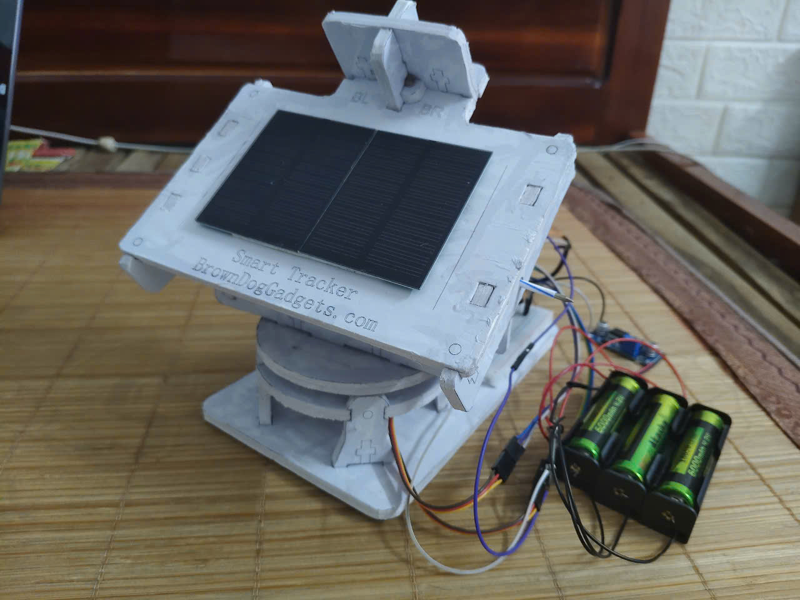
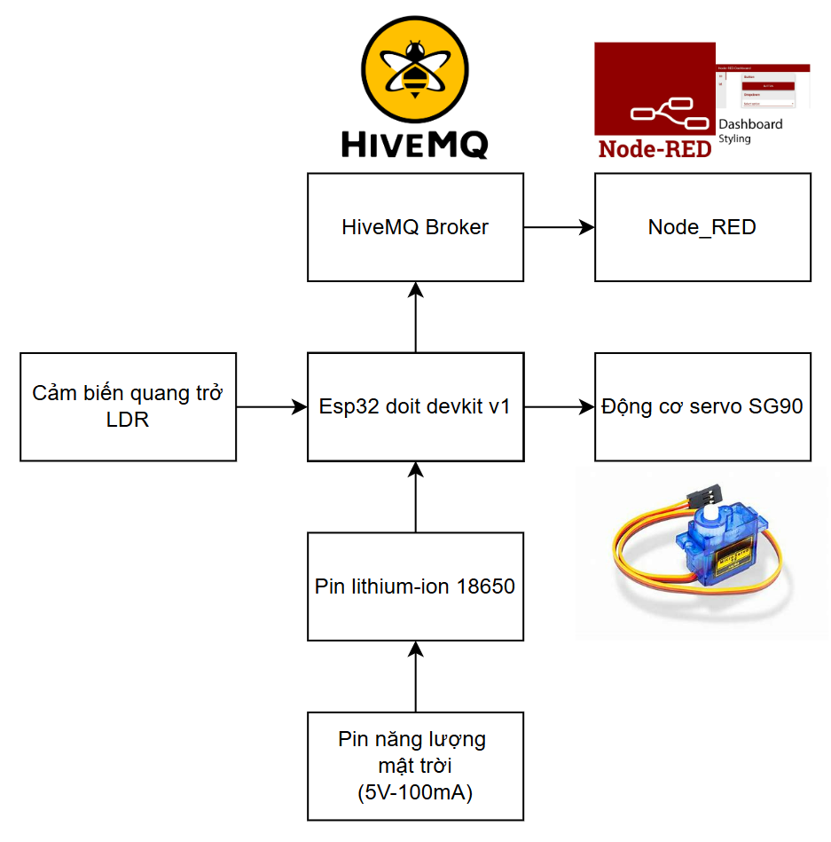
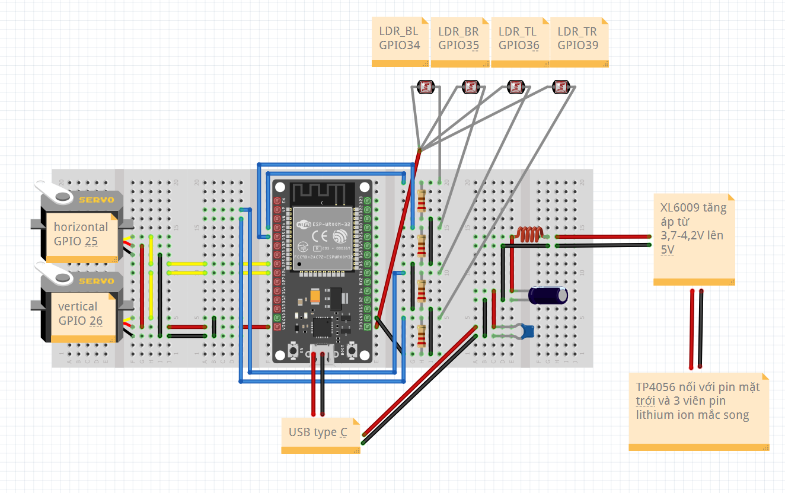
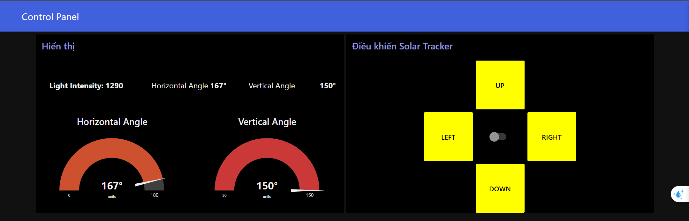
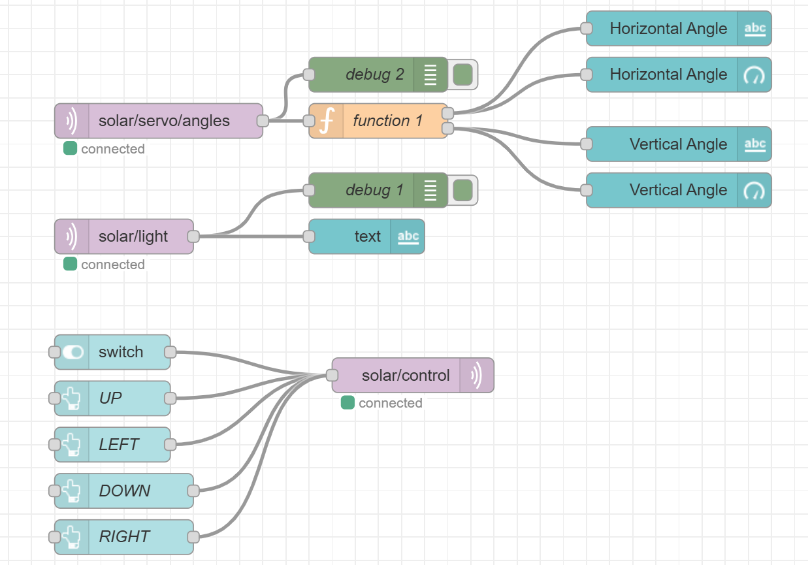

# Đề Tài: Mô Hình Bộ Điều Hướng Pin Mặt Trời

---

## 1. Đặt vấn đề

Đối với hầu hết các trường hợp, các tấm pin mặt trời phổ biến hàng ngày của chúng ta chạy với hiệu suất 18-20%, nghĩa là chúng chỉ chuyển đổi 18-20% lượng ánh sáng mặt trời nhận được thành điện năng.

Bài toán đặt ra là chúng ta cần cải thiện hiệu quả của các tấm pin hoặc tìm cách nhận được nhiều ánh sáng hơn.

Cách đơn giản nhất để tối ưu hóa năng lượng là điều chỉnh tấm pin hướng về mặt trời giống như cách hoa hướng dương hoạt động.

Trên thực tế, các tấm pin mặt trời có cơ chế theo dõi mặt trời tạo ra nhiều hơn khoảng 30% năng lượng mỗi ngày so với tấm pin cố định.

Dự án Mô Hình Bộ Điều Hướng Pin Mặt Trời được triển khai nhằm giải quyết vấn đề trên bằng cách sử dụng vi điều khiển ESP32, các cảm biến ánh sáng (LDR), động cơ servo SG90 và giao thức MQTT để điều khiển từ xa qua giao diện Node-RED Dashboard. Hệ thống này không chỉ cung cấp chế độ tự động mà còn cho phép điều khiển thủ công, mang lại sự linh hoạt và hiệu quả cao cho người dùng.

---

## 2. Cấu tạo

Hệ thống theo dõi mặt trời được cấu tạo bởi:

- **ESP32 DOIT Devkit V1**: Bộ điều khiển chính, có nhiệm vụ xử lý tín hiệu và điều khiển động cơ.
- **Cảm biến LDR (Light Dependent Resistor)**: Để đo cường độ ánh sáng từ các hướng khác nhau.
- **Động cơ Servo SG90**:
  - 1 động cơ servo chuyển động ngang.
  - 1 động cơ servo chuyển động dọc.
- **Tấm pin mặt trời**: Gồm 2 tấm mắc song song cung cấp tối đa 5V-100mA để sạc pin.
- **Pin lithium-ion**: Gồm 3 viên mắc song song.
- **Mạch sạc pin TP4056 và mạch tăng áp DC-DC XL6009 để tăng điện áp lên 5V**
- **Linh kiện khác**: điện trở, tụ hoá, tụ gốm, cuộn cảm, đế pin, dây dẫn...

**Sơ đồ khối:**

**Sơ đồ kết nối phần cứng:**

---

## 3. Nguyên lý hoạt động

Hệ thống hoạt động dựa trên sự chênh lệch cường độ ánh sáng nhận được từ các cảm biến LDR. Tín hiệu từ các cảm biến được gửi đến ESP32 để xử lý. Động cơ sẽ quay sang phía có cường độ ánh sáng lớn hơn cho đến khi bằng nhau thì dừng lại.

- **Chế độ tự động**:
  - Động cơ servo sẽ xoay để tấm pin mặt trời hướng đến nơi có ánh sáng mạnh nhất.
- **Chế độ thủ công**:
  - Người dùng có thể điều khiển động cơ thông qua giao diện Node-RED Dashboard để điều chỉnh tấm pin theo ý muốn.

**Giao diện Dashboard:**

---

**Luồng Node-RED:**

---

## 4. Kết quả
**Video kiểm tra hệ thống ở chế độ tự động:**
[Link Video](videos/kiem_tra_huong_theo_nguon_sang.mp4)

**Video kiểm tra hệ thống ở chế độ thủ công:**
[Link Video](videos/manual.mp4)

---

## 5. Kết luận

1. **Kết quả cho thấy mô hình đã đạt được mục đích ban đầu của dự án**:
   - Mô hình chứng minh khả năng tối ưu hóa góc đón nguồn sáng mạnh nhất.
   - Hệ thống phản hồi tích cực và tương đối chính xác.

2. **Hạn chế**:
   - Kết nối MQTT không ổn định, xảy ra hiện tượng trễ.
   - Vì sử dụng module tăng áp DC-DC XL6009 hoạt động theo nguyên lý switching, sinh ra nhiễu cao tần.
   - Động cơ có hiện tượng giật, khựng có thể do nhiễu hoặc thuật toán chưa tối ưu.
3. **Khắc phục**:
   - Sử dụng mạch lọc LC. 
   - Tối ưu chuyển động của động cơ bằng cách lọc nhiễu và tối ưu hóa thuật toán.
   - Thay module TP4056 bằng mạch sạc kết hợp tăng áp và lọc nhiễu tốt hơn.
